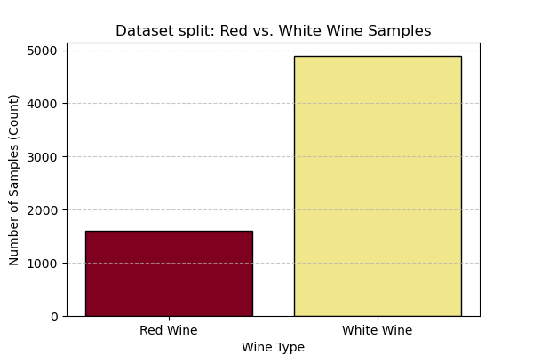
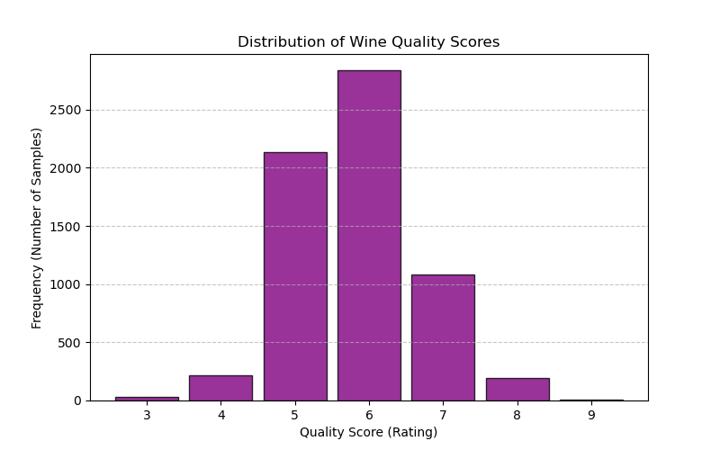
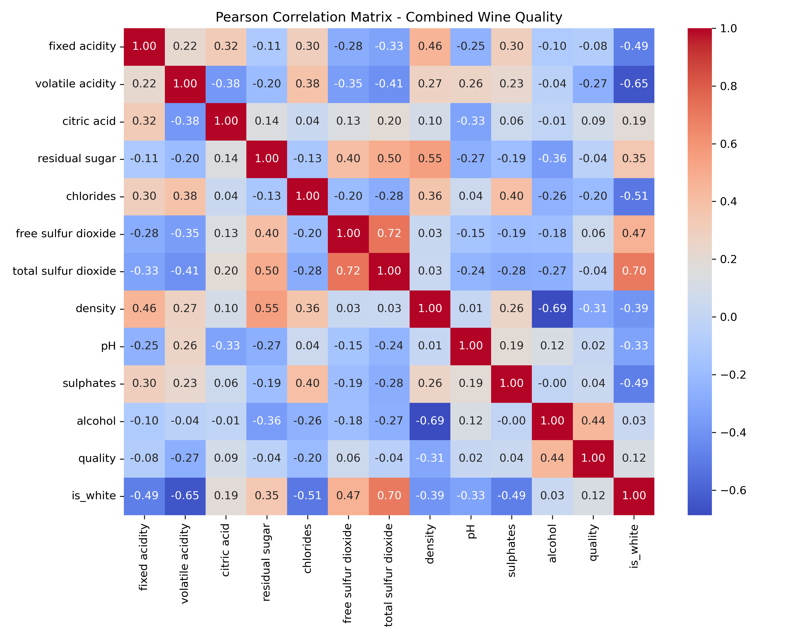

# Machine Learning Project: Predicting Wine Quality

## 1 Introduction

This project aims to predict wine quality based on objective physicochemical characteristics, such as acidity, density, pH, and residual sugar and alcohol content [1]. To achieve this, we will develop a machine learning model trained on a dataset of red and white variants of the Portuguese "Vinho Verde" wine. Each wine gets a quality score from 1 to 10, 10 being the best [1].

The rest of this report is structured as follows: Section 2 formalizes the application into a machine learning problem; Section 3 describes data preprocessing, correlation analysis, splitting strategy, and the Ridge Regression model; Section 4 documents the use of AI tools; and Section 5 presents references and the repository appendix.

## 2 Problem Formulation

We formulate this task as a supervised machine learning regression problem. Given an array of physicochemical measurements for a wine sample, our goal is to predict its continuous quality score $y_i \in \mathbb{R}$. Each data point $x_i \in \mathbb{R}^{12}$ represents a single wine sample defined by 12 feature variables:

| # | Feature Name | Data Type | Description [1] |
| --- | --- | --- | --- |
| 1 | fixed acidity | Continuous | Non-volatile acids ($\text{g/dm}^3$) |
| 2 | volatile acidity | Continuous | Acetic acid content ($\text{g/dm}^3$) |
| 3 | citric acid | Continuous | Freshness/flavor acid content ($\text{g/dm}^3$) |
| 4 | residual sugar | Continuous | Remaining sugar post-fermentation ($\text{g/dm}^3$) |
| 5 | chlorides | Continuous | Salt concentration ($\text{g/dm}^3$) |
| 6 | free sulfur dioxide | Continuous | Free $\text{SO}_2$ preventing microbial growth ($\text{mg/dm}^3$) |
| 7 | total sulfur dioxide | Continuous | Total free and bound $\text{SO}_2$ ($\text{mg/dm}^3$) |
| 8 | density | Continuous | Liquid density ($\text{g/cm}^3$) |
| 9 | pH | Continuous | Acidic/basic scale ($0–14$) |
| 10 | sulphates | Continuous | $\text{SO}_2$ gas additive ($\text{g/dm}^3$) |
| 11 | alcohol | Continuous | Alcohol content (% by volume) |
| 12 | is white | Binary | Variant indicator ($1 = \text{white}$, $0 = \text{red}$) |

## 3 Methods

### 3.1 Preparing the data

The dataset consists of $N = 6497$ total wine samples, split between red wine ($N_{\text{red}} = 1599$) and white wine ($N_{\text{white}} = 4898$). We concatenated both subsets into a single master dataset and introduced an engineered binary feature `is white` ($x_{i, 12} \in \{0, 1\}$) to allow the linear model to account for chemical baseline differences between wine types increasing our feature vector dimension to 12.

Figure 1 shows the sample count split between red and white wines. Figure 2 illustrates the distribution of target quality scores $y$; most ratings cluster around scores 5 and 6, showing that extreme scores are relatively rare, meaning that the data is not heavily skewed in either direction. This helps in making an accurate model.

### 3.2 Data correlation

Inspection of the Pearson correlation matrix (Figure 3) reveals notable collinearity among several feature pairs:

- **Sulfur Dioxide Metrics:** `free sulfur dioxide` and `total sulfur dioxide` exhibit a strong positive correlation ($r = 0.72$), as free $\text{SO}_2$ is a direct subset of total $\text{SO}_2$. We considered engineering a ratio feature $sulfur_{\text{ratio}} = \frac{\text{free\_sulfur\_dioxide}}{\text{total\_sulfur\_dioxide}}$, which may be tested in Stage 2.
- **Density Relationships:** `density` correlates negatively with `alcohol` ($r = -0.69$) and positively with `residual sugar` ($r = 0.55$), reflecting physical fluid properties.
- **Wine Variant Correlations:** The `is white` feature strongly correlates with `total sulfur dioxide` ($r = 0.70$) and negatively with `volatile acidity` ($r = -0.65$).

We retain all 12 features in our Stage 1 feature vector $X \in \mathbb{R}^{6497 \times 12}$. Retaining the full feature set preserves maximum physical variance and avoids potential underfitting caused by aggressive feature deletion.

### 3.3 Data splitting

We split the dataset into three disjoint partitions:

- **Training Set (60%, $N_{\text{train}} = 3898$):** Used for fitting parameter weights.
- **Validation Set (20%, $N_{\text{val}} = 1299$):** Reserved for hyperparameter tuning ($\lambda$) and model selection.
- **Test Set (20%, $N_{\text{test}} = 1300$):** Retained untouched for final generalization error evaluation.

### 3.4 Model Selection and Loss Function

To model continuous wine quality while handling correlated features without manual feature dropping, we select **Ridge Regression** as our model.

#### 3.4.1 Hypothesis Space

The hypothesis space consists of linear predictors mapping the 12-dimensional feature vector $x_i$ to a predicted score $\hat{y}_i$:
$$h(x_i, w) = w_0 + \sum_{j=1}^{12} w_j x_{ij} = w_0 + w^T x_i$$
where $w_0$ is the intercept/bias term and $w = (w_1, \dots, w_{12})^T$ is the weight vector.

#### 3.4.2 Loss Function and Regularization

We optimize the model using regularized Mean Squared Error (MSE) with an $L_2$-norm penalty:
$$L(w) = \frac{1}{2n} \sum_{i=1}^{n} \left(h(x_i, w) - y_i\right)^2 + \frac{\lambda}{2} \|w\|_2^2$$
where $\|w\|_2^2 = \sum_{j=1}^{12} w_j^2$ penalizes large weight magnitudes, and $\lambda \ge 0$ is the regularization hyperparameter. The $L_2$ penalty stabilizes weight estimation in the presence of collinearity (e.g., between sulfur dioxide features), mitigating overfitting and improving generalization performance without losing accuracy or data.

## 4 Use of AI

During this stage AI (Google Gemini) was used for the following tasks:

- **Brainstorming** Exploring different datasets and their suitability for our purposes.
- **LaTeX and Markdown formatting** Helping while writing our report to make sure that the document looks correct and does not have any syntax errors.
- **Report Structure and Grammar** Reviewing the grammar of the the report and its structure and suggesting possible fixes.

All of the code, data-analysis and report writing was done by hand by both members of the team. All of the AI suggestions were considered and reviewed carefully together.

## 5 Appendices and References

### 5.1 Appendices







### 5.2 Source Code

The full, runnable, source code is available in a public, anonymous GitHub repository:
<https://github.com/Computerplayer4/wine-machine-learning>

For reading convenience, it is also available below \[2\]\[3\]\[4\]\[5\]\[6\]:

```python
import pandas as pd
import numpy as np
import seaborn as sns
import matplotlib.pyplot as plt
from sklearn.model_selection import train_test_split
from sklearn.preprocessing import StandardScaler

# Reading the data
url_red = "https://archive.ics.uci.edu/ml/machine-learning-databases/wine-quality/winequality-red.csv"
url_white = "https://archive.ics.uci.edu/ml/machine-learning-databases/wine-quality/winequality-white.csv"

# Load data into dataframes
df_red = pd.read_csv(url_red, sep=';')
df_white = pd.read_csv(url_white, sep=';')

# Add the `is white` binary feature such that 0 = Red and 1 = White
df_red['is white'] = 0
df_white['is white'] = 1

# Combine the two dataframes into one ignoring the indexing as it's not useful to preserve it
df_wine = pd.concat([df_red, df_white], axis=0, ignore_index=True)

# Form the feature matrix X and label vector y
X = df_wine.drop(columns=['quality'])
y = df_wine['quality'].to_numpy()

# Splitting the dataset into training (60 %), validation (20 %) and test (20 %) sets
X_train, X_val_test, y_train, y_val_test = train_test_split(X, y, test_size=0.4, random_state=42)
X_val, X_test, y_val, y_test = train_test_split(X_val_test, y_val_test, test_size=0.5, random_state=42)

# Normalize the data to zero mean and unit variance
# We only use training data when calculating mu and sigma as we want to prevent data leakage
# These values will be used with training and validation data only
scaler = StandardScaler()
X_train_scaled = scaler.fit_transform(X_train)
X_val_scaled = scaler.transform(X_val)
X_test_scaled = scaler.transform(X_test)

# Generate EDA statistics
print("--- DATASET SUMMARY ---")
print(f"Total samples (N): {len(df_wine)}")
print(f"Total white wine samples: {len(df_white)}")
print(f"Total red wine samples: {len(df_red)}")
print(f"Feature vector dimension (d): {X.shape[1]}")
print(f"Train size: {len(X_train)}, Val size: {len(X_val)}, Test size: {len(X_test)}\n")

print(f"--- FEATURE SUMMARY STATISTICS ---")
print(df_wine.describe().T[['mean', 'std', 'min', 'max']])

# Generate wine counts figure

wine_counts = df_wine['is white'].value_counts()
plt.figure(figsize=(6, 4))
# Here 0 is Red an 1 is White as before
plt.bar(['Red Wine', 'White Wine'], [wine_counts.get(0, 0), wine_counts.get(1, 0)], color=['#800020', '#F0E68C'], edgecolor='black')
plt.title('Dataset split: Red vs. White Wine Samples')
plt.xlabel('Wine Type')
plt.ylabel('Number of Samples (Count)')
plt.grid(axis='y', linestyle='--', alpha=0.7)
plt.savefig('../assets/wine_type_split.png')
plt.show()

# Generate score histogram
plt.figure(figsize=(8, 5))
plt.hist(df_wine['quality'], bins=range(0,11), align='left', rwidth=0.85, color='purple', edgecolor='black', alpha=0.8)
plt.title('Distribution of Wine Quality Scores')
plt.xlabel('Quality Score (Rating)')
plt.ylabel('Frequency (Number of Samples)')
plt.xticks(range(0, 10))
plt.grid(axis='y', linestyle='--', alpha=0.7)
plt.savefig('../assets/quality_histogram.png')
plt.show()

# Generate Pearson Correlation Matrix Heatmap
plt.figure(figsize=(10, 8))
sns.heatmap(df_wine.corr(), annot=True, fmt=".2f", cmap="coolwarm")
plt.title("Pearson Correlation Matrix - Combined Wine Quality")
plt.tight_layout()
plt.savefig("../assets/correlation_matrix.png", dpi=300)
plt.show()
```

### 5.2 References

\[1\] P. Cortez, A. Cerdeira, F. Almeida, T. Matos, and J. Reis. "Wine Quality," UCI Machine Learning Repository, 2009. \[Online\]. Available: <https://doi.org/10.24432/C56S3T>.

\[2\] “pandas documentation — pandas 3.0.5 documentation.” <https://pandas.pydata.org/docs/>

\[3\] “NumPy documentation — NumPy v2.5 Manual.” <https://numpy.org/doc/stable/>

\[4\] “seaborn: statistical data visualization — seaborn 0.13.2 documentation.” <https://seaborn.pydata.org/>

\[5\] “Using Matplotlib — Matplotlib 3.11.2 documentation.” <https://matplotlib.org/stable/users/index>

\[6\] “User Guide,” Scikit-learn. <https://scikit-learn.org/stable/user_guide.html>
