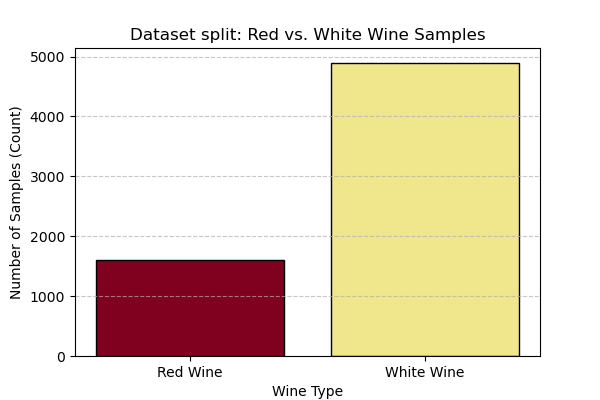
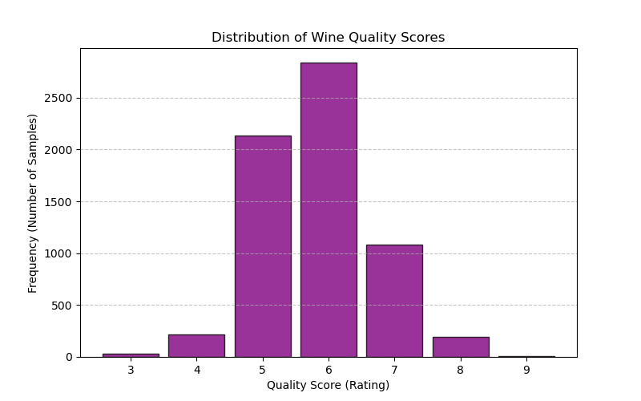
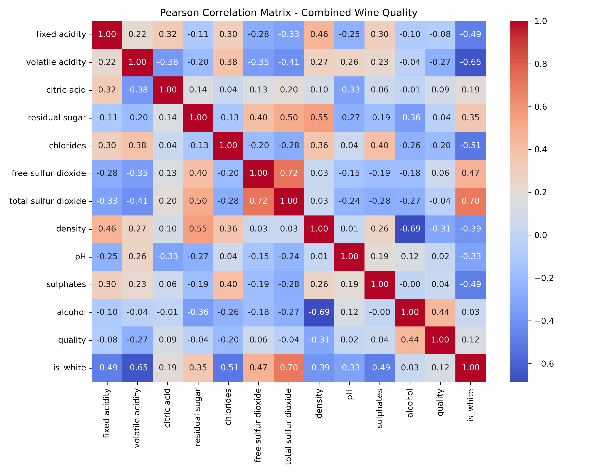
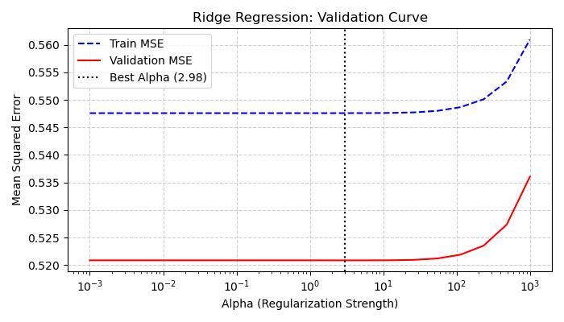
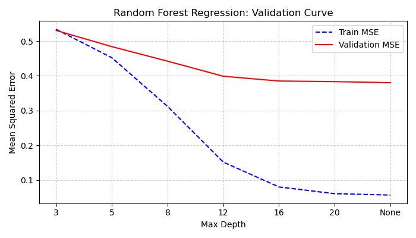

# Machine Learning Project: Predicting Wine Quality

## 1 Introduction

This project aims to predict wine quality based on objective physicochemical characteristics, such as acidity, density, pH, and residual sugar and alcohol content [1]. To achieve this, we will develop a machine learning model trained on a dataset of red and white variants of the Portuguese "Vinho Verde" wine. Each wine gets a quality score from 1 to 10, 10 being the best [1].

The rest of this report is structured as follows: Section 2 formalizes the application into a machine learning problem; Section 3 describes data preprocessing, correlation analysis, splitting strategy, and the Ridge Regression model; Section 4 analyses the results; Section 5 is the conclusion; Section 6 documents the use of AI tools; and Section 7 presents references and the repository appendix.

## 2 Problem Formulation

We formulate this task as a supervised machine learning regression problem. Given an array of physicochemical measurements for a wine sample, our goal is to predict its integer quality score $y_i \in \mathbb{Z}$. Each data point $x_i \in \mathbb{R}^{12}$ represents a single wine sample defined by 12 feature variables:

| # | Feature Name | Data Type | Description [1] |
| --- | --- | --- | --- |
| 1 | fixed acidity | Continuous | Non-volatile acids ($\text{g/dm}^3$) |
| 2 | volatile acidity | Continuous | Acetic acid content ($\text{g/dm}^3$) |
| 3 | citric acid | Continuous | Freshness/flavor acid content ($\text{g/dm}^3$) |
| 4 | residual sugar | Continuous | Remaining sugar post-fermentation ($\text{g/dm}^3$) |
| 5 | chlorides | Continuous | Salt concentration ($\text{g/dm}^3$) |
| 6 | free sulfur dioxide | Continuous | Free $\text{SO}_2$ preventing microbial growth ($\text{mg/dm}^3$) |
| 7 | total sulfur dioxide | Continuous | Total free and bound $\text{SO}_2$ ($\text{mg/dm}^3$) |
| 8 | density | Continuous | Liquid density ($\text{g/cm}^3$) |
| 9 | pH | Continuous | Acidic/basic scale ($0–14$) |
| 10 | sulphates | Continuous | $\text{SO}_2$ gas additive ($\text{g/dm}^3$) |
| 11 | alcohol | Continuous | Alcohol content (% by volume) |
| 12 | is white | Binary | Variant indicator ($1 = \text{white}$, $0 = \text{red}$) |

## 3 Methods

### 3.1 Preparing the data

The dataset consists of $N = 6497$ total wine samples, split between red wine ($N_{\text{red}} = 1599$) and white wine ($N_{\text{white}} = 4898$). We concatenated both subsets into a single master dataset and introduced an engineered binary feature `is white` ($x_{i, 12} \in \{0, 1\}$) to allow the linear model to account for chemical baseline differences between wine types increasing our feature vector dimension to 12.

Figure 1 shows the sample count split between red and white wines. Figure 2 illustrates the distribution of target quality scores $y$; most ratings cluster around scores 5 and 6, showing that extreme scores are relatively rare, meaning that the data is not heavily skewed in either direction. This helps in making an accurate model. In addition it is worth mentioning that no wine received a score of 0, 1, 2 or 10. These values are, therefore, omitted from the histogram.

### 3.2 Data correlation

Inspection of the Pearson correlation matrix (Figure 3) reveals notable collinearity among several feature pairs:

- **Sulfur Dioxide Metrics:** `free sulfur dioxide` and `total sulfur dioxide` exhibit a strong positive correlation ($r = 0.72$), as free $\text{SO}_2$ is a direct subset of total $\text{SO}_2$. We considered engineering a ratio feature $sulfur_{\text{ratio}} = \frac{\text{free\_sulfur\_dioxide}}{\text{total\_sulfur\_dioxide}}$, which may be tested in Stage 2.
- **Density Relationships:** `density` correlates negatively with `alcohol` ($r = -0.69$) and positively with `residual sugar` ($r = 0.55$), reflecting physical fluid properties.
- **Wine Variant Correlations:** The `is white` feature strongly correlates with `total sulfur dioxide` ($r = 0.70$) and negatively with `volatile acidity` ($r = -0.65$).

We retain all 12 features in our Stage 1 feature vector $X \in \mathbb{R}^{6497 \times 12}$. Retaining the full feature set preserves maximum physical variance and avoids potential underfitting caused by aggressive feature deletion.

### 3.3 Data splitting

We split the dataset into three disjoint partitions:

- **Training Set (60%, $N_{\text{train}} = 3898$):** Used for fitting parameter weights.
- **Validation Set (20%, $N_{\text{val}} = 1299$):** Reserved for hyperparameter tuning ($\lambda$) and model selection.
- **Test Set (20%, $N_{\text{test}} = 1300$):** Retained untouched for final generalization error evaluation.

This provides a large enough training set without sacrificing validation or test capacity. To prevent feature scale disparities from dominating the $L_2$ penalty, we apply z-score standardization:
$$\tilde{x}_{ij} = \frac{x_{ij} - \mu_j}{\sigma_j}$$
To avoid data leakage, feature means ($\mu_j$) and standard deviations ($\sigma_j$) are calculated strictly on the training set and subsequently applied to transform the validation and test sets.

### 3.4 Model Selection and Loss Function

To model continuous wine quality while handling correlated features without manual feature dropping, we select **Ridge Regression** and **Random Forest** as our models, comparing their performance at the end.

#### 3.4.1 Hypothesis Space

The hypothesis space consists of linear predictors mapping the 12-dimensional feature vector $x_i$ to a predicted score $\hat{y}_i$:
$$h(x_i, w) = w_0 + \sum_{j=1}^{12} w_j x_{ij} = w_0 + w^T x_i$$
where $w_0$ is the intercept/bias term and $w = (w_1, \dots, w_{12})^T$ is the weight vector.

#### 3.4.2 Loss Function and Regularization

We optimize the model using regularized Mean Squared Error (MSE) with an $L_2$-norm penalty:
$$L(w) = \frac{1}{2n} \sum_{i=1}^{n} \left(h(x_i, w) - y_i\right)^2 + \frac{\lambda}{2} \|w\|_2^2$$
where $\|w\|_2^2 = \sum_{j=1}^{12} w_j^2$ penalizes large weight magnitudes, and $\lambda \ge 0$ is the regularization hyperparameter. The $L_2$ penalty stabilizes weight estimation in the presence of collinearity (e.g., between sulfur dioxide features), mitigating overfitting and improving generalization performance without losing accuracy or data.

## 4 Results

- diagrams of the training and validation errors for different models (for both methods)
- the final chosen method is the one with the least validation error in both cases

### 4.1 Ridge Regression

### 4.2 Random Forest

### 4.3 Comparison

- chosing between ridge and random forest?
- test error(s)

## 5 Conclusion

### 5.1 Summary

In this project, we evaluated multiple Ridge Regression and Random Forest models to predict wine quality. Based on the validation errors, the Random Forest model with unrestricted depth achieved the best performane.

### 5.2 Limitations and possible improvements

The greatest limitation of our application is the fact that the dataset consists exclusively of the red and white variants of the Portuguese "Vinho Verde" wine. Consequently, it is unlikely that our model would perform as accurately if applied to other wine varieties or regions.

- TODO: room for improvement?

## 6 Use of AI

In our project AI (Google Gemini) was used for the following tasks:

- **Brainstorming** Exploring different datasets and their suitability for our purposes.
- **LaTeX and Markdown formatting** Helping while writing our report to make sure that the document looks correct and does not have any syntax errors.
- **Report Structure and Grammar** Reviewing the grammar of the the report and its structure and suggesting possible fixes.
- TODO: usage in 2nd stage

All of the code, data-analysis and report writing was done by hand by both members of the team. All of the AI suggestions were considered and reviewed carefully together.

## 7 Appendices and References

### 7.1 Visualization












### 7.2 Source Code

The full, runnable, source code is available in a public, anonymous GitHub repository:
<https://github.com/Computerplayer4/wine-machine-learning>

For reading convenience, it is also available below \[2\]\[3\]\[4\]\[5\]\[6\]:

`preprocess.py`

```python
"""This module contains functions for loading and preprocessing 
the wine quality dataset from the UCI repository, 
as well as generating exploratory data analysis (EDA) plots."""

import pandas as pd
import seaborn as sns
import matplotlib.pyplot as plt
from sklearn.model_selection import train_test_split
from sklearn.preprocessing import StandardScaler
from pathlib import Path


def load_and_preprocess_data():
    """Load and preprocess the wine quality dataset from UCI repository."""
    
    # Reading the data
    url_red = "https://archive.ics.uci.edu/ml/machine-learning-databases/wine-quality/winequality-red.csv"
    url_white = "https://archive.ics.uci.edu/ml/machine-learning-databases/wine-quality/winequality-white.csv"

    # Load data into dataframes
    df_red = pd.read_csv(url_red, sep=';')
    df_white = pd.read_csv(url_white, sep=';')

    # Add the `is white` binary feature such that 0 = Red and 1 = White
    df_red['is white'] = 0
    df_white['is white'] = 1

    # Combine the two dataframes into one ignoring the indexing as it's not useful to preserve it
    df_wine = pd.concat([df_red, df_white], axis=0, ignore_index=True)
    
    # Custom engineered feature
    # The small addition of 1e-5 makes sure we never divide by 0
    df_wine['sulfur ratio'] = df_wine['free sulfur dioxide'] / (df_wine['total sulfur dioxide'] + 1e-5)

    # Form the feature matrix X and label vector y
    X = df_wine.drop(columns=['quality'])
    y = df_wine['quality'].to_numpy()

    # Splitting the dataset into training (60 %), validation (20 %) and test (20 %) sets
    # Stratified sampling is used to ensure that distribution of red and whit wines is preserved
    X_train, X_val_test, y_train, y_val_test = train_test_split(X, y, test_size=0.4, random_state=42, stratify=X['is white'])
    X_val, X_test, y_val, y_test = train_test_split(X_val_test, y_val_test, test_size=0.5, random_state=42, stratify=X_val_test['is white'])

    # Normalize the data to zero mean and unit variance
    # We only use training data when calculating mu and sigma as we want to prevent data leakage
    # These values will be used with training and validation data only
    scaler = StandardScaler()
    X_train_scaled = scaler.fit_transform(X_train)
    X_val_scaled = scaler.transform(X_val)
    X_test_scaled = scaler.transform(X_test)
    
    feature_names = X.columns.tolist()
    
    # Generate dataset summary
    print("--- DATASET SUMMARY ---")
    print(f"Total samples (N): {len(df_wine)}")
    print(f"Total white wine samples: {len(df_white)}")
    print(f"Total red wine samples: {len(df_red)}")
    print(f"Feature vector dimension (d): {X.shape[1]}")
    print(f"Train size: {len(X_train)}, Val size: {len(X_val)}, Test size: {len(X_test)}\n")

    print("--- FEATURE SUMMARY STATISTICS ---")
    print(df_wine.describe().T[['mean', 'std', 'min', 'max']])
    print("\nData preprocessing completed successfully.\n")
    return {
        'X_train': X_train_scaled, 'y_train': y_train,
        'X_val': X_val_scaled,     'y_val': y_val,
        'X_test': X_test_scaled,   'y_test': y_test,
        'feature_names': feature_names,
        'df_wine': df_wine
    }

def generate_eda_plots(df_wine):
    """Generate exploratory data analysis statistics and plots for the wine data."""

    project_root = Path(__file__).resolve().parent.parent
    assests_dir = project_root / 'assets'
    assests_dir.mkdir(parents=True, exist_ok=True)

    # Generate wine counts figure
    wine_counts = df_wine['is white'].value_counts()
    plt.figure(figsize=(6, 4))
    # Here 0 is Red an 1 is White as before
    plt.bar(['Red Wine', 'White Wine'], [wine_counts.get(0, 0), wine_counts.get(1, 0)], color=['#800020', '#F0E68C'], edgecolor='black')
    plt.title('Dataset split: Red vs. White Wine Samples')
    plt.xlabel('Wine Type')
    plt.ylabel('Number of Samples (Count)')
    plt.grid(axis='y', linestyle='--', alpha=0.7)
    plt.savefig(assests_dir / 'wine_type_split.png')
    plt.show()

    # Generate score histogram
    plt.figure(figsize=(8, 5))
    plt.hist(df_wine['quality'], bins=range(3,11), align='left', rwidth=0.85, color='purple', edgecolor='black', alpha=0.8)
    plt.title('Distribution of Wine Quality Scores')
    plt.xlabel('Quality Score (Rating)')
    plt.ylabel('Frequency (Number of Samples)')
    plt.xticks(range(3, 10))
    plt.grid(axis='y', linestyle='--', alpha=0.7)
    plt.savefig(assests_dir / 'quality_histogram.png')
    plt.show()

    # Generate Pearson Correlation Matrix Heatmap
    plt.figure(figsize=(10, 8))
    sns.heatmap(df_wine.corr(), annot=True, fmt=".2f", cmap="coolwarm")
    plt.title("Pearson Correlation Matrix - Combined Wine Quality")
    plt.tight_layout()
    plt.savefig(assests_dir / "correlation_matrix.png", dpi=300)
    plt.show()

if __name__ == "__main__":
    data = load_and_preprocess_data()
    generate_eda_plots(data['df_wine'])
    print("Preprocessing and EDA complete")
```

`training.py`

```python
import numpy as np
import matplotlib.pyplot as plt
from sklearn.metrics import mean_squared_error, mean_absolute_error, r2_score
from sklearn.linear_model import Ridge
from sklearn.ensemble import RandomForestRegressor
from pathlib import Path

from preprocess import load_and_preprocess_data

def evaluate_model():
    """Evaluate the performance of Ridge and Random Forest models on the wine quality dataset."""
    
    # === Load and preprocess the data ===
    data = load_and_preprocess_data()
    X_tr, y_tr = data['X_train'], data['y_train']
    X_val, y_val = data['X_val'], data['y_val']
    X_te, y_te = data['X_test'], data['y_test']
    
    # === Method 1: Ridge Regression ===
    alphas = np.logspace(-3, 3, 20)
    ridge_tr_errors, ridge_val_errors = [], []
    
    best_ridge_alpha = None
    best_ridge_val_mse = float('inf')
    best_ridge_model = None
    
    for alpha in alphas:
        ridge = Ridge(alpha=alpha, random_state=42)
        ridge.fit(X_tr, y_tr)
        
        tr_mse = mean_squared_error(y_tr, ridge.predict(X_tr))
        val_mse = mean_squared_error(y_val, ridge.predict(X_val))
        
        ridge_tr_errors.append(tr_mse)
        ridge_val_errors.append(val_mse)
        
        if val_mse < best_ridge_val_mse:
            best_ridge_val_mse = val_mse
            best_ridge_alpha = alpha
            best_ridge_model = ridge

    # === Method 2: Random Forest Regression ===
    depths = [3, 5, 8, 12, 16, 20, None]
    depths_labels = [str(d) for d in depths]
    rf_tr_errors, rf_val_errors = [], []
    
    best_rf_depth = None
    best_rf_val_mse = float('inf')
    best_rf_model = None
    
    for depth in depths:
        rf = RandomForestRegressor(max_depth=depth, random_state=42)
        rf.fit(X_tr, y_tr)

        tr_mse = mean_squared_error(y_tr, rf.predict(X_tr))
        val_mse = mean_squared_error(y_val, rf.predict(X_val))
        
        rf_tr_errors.append(tr_mse)
        rf_val_errors.append(val_mse)
        
        if val_mse < best_rf_val_mse:
            best_rf_val_mse = val_mse
            best_rf_depth = depth
            best_rf_model = rf

    project_root = Path(__file__).resolve().parent.parent
    assets_dir = project_root / 'assets'
    assets_dir.mkdir(parents=True, exist_ok=True)
    
    # Ridge Regression Validation Curve
    plt.figure(figsize=(7, 4))
    plt.semilogx(alphas, ridge_tr_errors, label='Train MSE', color='blue', linestyle='--')
    plt.semilogx(alphas, ridge_val_errors, label='Validation MSE', color='red')
    plt.axvline(best_ridge_alpha, color='black', linestyle=':', label=f'Best Alpha ({best_ridge_alpha:.2f})')
    plt.title('Ridge Regression: Validation Curve')
    plt.xlabel('Alpha (Regularization Strength)')
    plt.ylabel('Mean Squared Error')
    plt.legend()
    plt.grid(True, linestyle='--', alpha=0.6)
    plt.tight_layout()
    plt.savefig(assets_dir / 'ridge_validation_curve.png')
    plt.show()

    # Random Forest Regression Validation Curve
    plt.figure(figsize=(7, 4))
    x_indices = range(len(depths))
    plt.plot(x_indices, rf_tr_errors, label='Train MSE', color='blue', linestyle='--')
    plt.plot(x_indices, rf_val_errors, label='Validation MSE', color='red')
    plt.xticks(x_indices, depths_labels)
    plt.title('Random Forest Regression: Validation Curve')
    plt.xlabel('Max Depth')
    plt.ylabel('Mean Squared Error')
    plt.legend()
    plt.grid(True, linestyle='--', alpha=0.6)
    plt.tight_layout()
    plt.savefig(assets_dir / 'rf_validation_curve.png')
    plt.show()
    
    print("=== Model Validation Summary ===")
    print(f"Best Ridge Regression Alpha: {best_ridge_alpha:.4f} with Validation MSE: {best_ridge_val_mse:.4f}")
    print(f"Best Random Forest Max Depth: {best_rf_depth} with Validation MSE: {best_rf_val_mse:.4f}")
    
    if best_rf_val_mse < best_ridge_val_mse:
        winning_name = "Random Forest Regression"
        winning_model = best_rf_model
        winning_val_mse = best_rf_val_mse
    else:
        winning_name = "Ridge Regression"
        winning_model = best_ridge_model
        winning_val_mse = best_ridge_val_mse
    
    print(f"Selected Model for Testing: {winning_name} with Validation MSE: {winning_val_mse:.4f}")
    
    test_preds = winning_model.predict(X_te)
    test_mse = mean_squared_error(y_te, test_preds)
    test_mae = mean_absolute_error(y_te, test_preds)
    test_r2 = r2_score(y_te, test_preds)
    
    print("\n=== Test Set Performance ===")
    print(f"Test MSE: {test_mse:.4f}")
    print(f"Test MAE: {test_mae:.4f}")
    print(f"Test R^2 Score: {test_r2:.4f}")
    
    save_visual_results_table(
        best_ridge_val_mse, best_rf_val_mse, winning_name, 
        test_mse, test_mae, test_r2, best_ridge_alpha, best_rf_depth
    )
   
def save_visual_results_table(ridge_val_mse, rf_val_mse, winning_name, test_mse, test_mae, test_r2, best_ridge_alpha, best_rf_depth):
    """Save the performance metrics as a table in the assets directory"""
    project_root = Path(__file__).resolve().parent.parent
    assets_dir = project_root / 'assets'
    assets_dir.mkdir(parents=True, exist_ok=True)

    rf_depth_str = f"max_depth = {best_rf_depth}" if best_rf_depth is not None else "max_depth = None"
    
    data_matrix = [
        ["Ridge Regression", f"alpha = {best_ridge_alpha:.4f}", f"{ridge_val_mse:.4f}", "—", "—", "—"],
        [f"{winning_name}", rf_depth_str, f"{rf_val_mse:.4f}", f"{test_mse:.4f}", f"{test_mae:.4f}", f"{test_r2:.4f}"]
    ]
    columns = ["Model Class", "Best Hyperparameter", "Validation MSE", "Test MSE", "Test MAE", "Test R²"]
    
    fig, ax = plt.subplots(figsize=(13, 2.2))
    ax.axis('tight')
    ax.axis('off')
    
    table = ax.table(cellText=data_matrix, colLabels=columns, loc='center', cellLoc='center')
    table.auto_set_font_size(False)
    table.set_fontsize(10)
    table.scale(1.2, 1.8)
    
    for (row, col), cell in table.get_celld().items():
        if row == 0:
            cell.set_text_props(weight='bold', color='white')
            cell.set_facecolor('#2C3E50')
        else:
            cell.set_facecolor('#E8F8F5' if row == 2 else '#F8F9F9')
    
    plt.title("Model Performance Summary", fontsize=12, weight='bold', pad=12)
    plt.tight_layout()
    plt.savefig(assets_dir / 'model_performance_summary.png')
    plt.show()

if __name__ == "__main__":
    evaluate_model()
```

### 7.3 References

\[1\] P. Cortez, A. Cerdeira, F. Almeida, T. Matos, and J. Reis. "Wine Quality," UCI Machine Learning Repository, 2009. \[Online\]. Available: <https://doi.org/10.24432/C56S3T>.

\[2\] “pandas documentation — pandas 3.0.5 documentation.” <https://pandas.pydata.org/docs/>

\[3\] “NumPy documentation — NumPy v2.5 Manual.” <https://numpy.org/doc/stable/>

\[4\] “seaborn: statistical data visualization — seaborn 0.13.2 documentation.” <https://seaborn.pydata.org/>

\[5\] “Using Matplotlib — Matplotlib 3.11.2 documentation.” <https://matplotlib.org/stable/users/index>

\[6\] “User Guide,” Scikit-learn. <https://scikit-learn.org/stable/user_guide.html>
