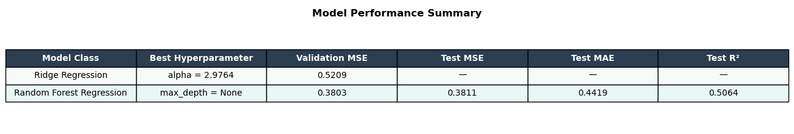

# Machine Learning Project: Predicting Wine Quality

## 1 Introduction

This project aims to predict wine quality based on objective physicochemical characteristics, such as acidity, density, pH, and residual sugar and alcohol content [1]. To achieve this, we will develop a machine learning model trained on a dataset of red and white variants of the Portuguese "Vinho Verde" wine. Each wine is assigned an integer quality score rating between 1 and 10 based on sensory evaluations by expert tasting panels [1].

The rest of this report is structured as follows: Section 2 formalizes the application into a machine learning problem; Section 3 describes data preprocessing, stratified splitting, feature engineering, and model hypothesis spaces; Section 4 presents validation results, model selection, and final test set performance; Section 5 concludes with a discussion of findings and limitations; Section 6 documents the use of AI tools; and Section 7 provides references and the repository code appendix.

## 2 Problem Formulation

We formulate this task as a supervised machine learning regression problem. Given an array of physicochemical measurements for a wine sample, our goal is to predict its integer quality score $y_i \in \mathbb{Z}$. Each data point $x_i \in \mathbb{R}^{13}$ represents a single wine sample defined by 13 feature variables:

| # | Feature Name | Data Type | Description [1] |
| --- | --- | --- | --- |
| 1 | fixed acidity | Continuous | Non-volatile acids ($\text{g/dm}^3$) |
| 2 | volatile acidity | Continuous | Acetic acid content ($\text{g/dm}^3$) |
| 3 | citric acid | Continuous | Freshness/flavor acid content ($\text{g/dm}^3$) |
| 4 | residual sugar | Continuous | Remaining sugar post-fermentation ($\text{g/dm}^3$) |
| 5 | chlorides | Continuous | Salt concentration ($\text{g/dm}^3$) |
| 6 | free sulfur dioxide | Continuous | Free $\text{SO}_2$ preventing microbial growth ($\text{mg/dm}^3$) |
| 7 | total sulfur dioxide | Continuous | Total free and bound $\text{SO}_2$ ($\text{mg/dm}^3$) |
| 8 | density | Continuous | Liquid density ($\text{g/cm}^3$) |
| 9 | pH | Continuous | Acidic/basic scale ($0–14$) |
| 10 | sulphates | Continuous | $\text{SO}_2$ gas additive ($\text{g/dm}^3$) |
| 11 | alcohol | Continuous | Alcohol content (% by volume) |
| 12 | is white | Binary | Variant indicator ($1 = \text{white}$, $0 = \text{red}$) |
| 13 | sulfur ratio | Continuous | Ratio of free to total $\text{SO}_2$ ($\text{free SO}_2 / (\text{total SO}_2 + 10^{-5})$) |

## 3 Methods

### 3.1 Preparing the Data

The dataset consists of $N = 6497$ total wine samples, split between red wine ($N_{\text{red}} = 1599$) and white wine ($N_{\text{white}} = 4898$). We combined both subsets into a single master dataset and introduced an engineered binary feature `is white` ($x_{i, 12} \in \{0, 1\}$) to allow the linear model to account for chemical baseline differences between wine variants [1].

Figure 1 displays the sample count split between red and white wines. Figure 2 illustrates the distribution of target quality scores $y$; most ratings cluster around scores 5 and 6, showing that extreme scores are relatively rare, meaning that the data is not heavily skewed in either direction. This helps in making an accurate model. In addition it is worth mentioning that no wine received a score of 0, 1, 2 or 10. These values are, therefore, omitted from the histogram.

### 3.2 Data correlation and Feature Engineering

Inspection of the Pearson correlation matrix (Figure 3) reveals notable collinearity among several feature pairs:

- **Sulfur Dioxide Metrics:** `free sulfur dioxide` and `total sulfur dioxide` exhibit a strong positive correlation ($r = 0.72$), as free $\text{SO}_2$ is a direct subset of total $\text{SO}_2$.
- **Density Relationships:** `density` correlates negatively with `alcohol` ($r = -0.69$) and positively with `residual sugar` ($r = 0.55$), reflecting physical fluid properties.
- **Wine Variant Correlations:** The `is white` feature strongly correlates with `total sulfur dioxide` ($r = 0.70$) and negatively with `volatile acidity` ($r = -0.65$).

We retain all 12 features in our feature vector. Retaining the full feature set preserves maximum physical variance and avoids potential underfitting caused by aggressive feature deletion.

Based on our Stage 1 correlation matrix (Figure 3), which revealed a strong positive collinearity between `free sulfur dioxide` and `total sulfur dioxide` ($r = 0.72$), we engineered a 13th feature:
$$\text{sulfur ratio}_i = \frac{\text{free sulfur dioxide}_i}{\text{total sulfur dioxide}_i + 10^{-5}}$$
This ratio explicitly measures the relative proportion of active antimicrobial sulfur dioxide relative to overall bound sulfur content. This increases our feature vector dimension to 13: $X \in \mathbb{R}^{6497 \times 13}$.

### 3.3 Data Splitting and Standardization

To preserve class balance across data splits and prevent partition skew between white ($75.4\%$) and red ($24.6\%$) wines, we implemented **stratified random sampling** on the `is white` indicator:

- **Training Set (60%, $N_{\text{train}} = 3898$):** Used for fitting parameter weights.
- **Validation Set (20%, $N_{\text{val}} = 1299$):** Reserved for hyperparameter tuning and model selection.
- **Test Set (20%, $N_{\text{test}} = 1300$):** Retained untouched for final generalization error evaluation.

To prevent feature scale disparities from dominating loss optimization or regularization penalties, all continuous features were standardized using Z-score normalization:
$$\tilde{x}_{ij} = \frac{x_{ij} - \mu_j}{\sigma_j}$$
To prevent data leakage, mean ($\mu_j$) and standard deviation ($\sigma_j$) parameters were calculated strictly on $X_{\text{train}}$ and subsequently applied to transform $X_{\text{val}}$ and $X_{\text{test}}$.

### 3.4 Model Selection and Loss Function

To model continuous wine quality while handling correlated features without manual feature dropping, we select **Ridge Regression** (a parametric regularized linear model) and **Random Forest** (a non-parametric tree ensemble) as our models, comparing their performance at the end.

#### 3.4.1 Method 1: Ridge Regression ($L_2$-Regularized Linear Model)

The linear hypothesis space maps the 13-dimensional scaled feature vector $x_i$ to a predicted continuous rating $\hat{y}_i$:
$$h_{\text{Ridge}}(x_i; w) = w_0 + \sum_{j=1}^{13} w_j x_{ij} = w_0 + w^T x_i$$
We fit the weight parameters $w$ using regularized Mean Squared Error (MSE) with an $L_2$-norm penalty:
$$L_{\text{Ridge}}(w) = \frac{1}{n} \sum_{i=1}^{n} \left(h(x_i; w) - y_i\right)^2 + \alpha \Vert{}w\Vert{}_2^2$$
where $\Vert{}w\Vert{}_2^2 = \sum_{j=1}^{13} w_j^2$ penalizes large weight magnitudes, and $\alpha \ge 0$ is the regularization hyperparameter controlling the bias-variance tradeoff.

#### 3.4.2 Method 2: Random Forest Regressor (Ensemble of Decision Trees)

Random Forest is a non-parametric ensemble method that constructs $B = 100$ decorrelated decision trees $T_b(x)$. Each tree is trained on a bootstrap sample of the training data using random feature subspace splits. The final ensemble prediction is the average across all decision trees:
$$h_{\text{RF}}(x_i) = \frac{1}{B} \sum_{b=1}^{B} T_b(x_i)$$
Individual decision tree splits minimize node impurity measured via Mean Squared Error:
$$\text{MSE}_{\text{node}} = \frac{1}{N_{\text{node}}} \sum_{i \in \text{node}} (y_i - \bar{y}_{\text{node}})^2$$
We tune the hyperparameter `max_depth` $\in [3, 5, 8, 12, 16, 20, \text{None}]$ to evaluate the trade-off between individual tree capacity and ensemble generalization.

## 4 Results

### 4.1 Ridge Regression

We evaluated Ridge Regression across a logarithmic grid of regularization strengths $\alpha \in [10^{-3}, 10^3]$. Figure 4 illustrates the resulting validation curve:

- **Low Regularization ($\alpha < 1.0$):** Validation loss remains flat and optimal ($\text{MSE} \approx 0.5209$).
- **High Regularization ($\alpha > 10.0$):** As $\alpha$ increases toward $1000$, both training and validation MSE rise sharply ($\text{MSE} > 0.5360$), as the heavy $L_2$ penalty forces weight coefficients too close to zero, causing underfitting (high bias).

The optimal hyperparameter was identified at $\alpha = 2.9764$, achieving a **Validation MSE of $0.5209$**.

### 4.2 Random Forest

We evaluated Random Forest performance across varying maximum tree depth constraints. Figure 5 presents the validation curve:

- **Shallow Trees ($\text{max\_depth} \le 5$):** High bias dominates, resulting in elevated training and validation MSE ($\text{MSE} \approx 0.48–0.53$).
- **Deep Trees ($\text{max\_depth} \ge 12$):** Training MSE drops steadily toward $0.06$ as deep decision trees memorize training patterns. However, Validation MSE plateaus near $0.3800$.
- **Unconstrained Growth ($\text{max\_depth} = \text{None}$):** The lowest validation error was achieved when tree depth was unconstrained ($\mathbf{\text{max\_depth} = \text{None}}$), yielding a **Validation MSE of $0.3803$**.

While individual unpruned trees overfit, Random Forest's bootstrap aggregation (bagging) and feature subsampling neutralize individual tree noise, enabling deep trees to model complex non-linear feature interactions without degrading validation performance.

### 4.3 Comparison

Random Forest outperformed Ridge Regression by **$27.0\%$** in Validation MSE ($0.3803$ vs $0.5209$). This substantial improvement demonstrates that wine quality is non-linear and benefits from decision tree ensembles capable of capturing complex interactions among chemical properties (such as alcohol content, volatile acidity, and density).

Having selected Random Forest Regressor ($\text{max\_depth} = \text{None}$) based on validation error, we evaluated its generalization performance on the held-out test set ($N_{\text{test}} = 1300$)

The Test MSE ($0.3811$) is virtually identical to the Validation MSE ($0.3803$), confirming that the model generalizes reliably to unseen samples without overfitting. An $R^2$ score of $0.5064$ indicates that the model accounts for $50.6\%$ of the total variance in human quality ratings using objective chemical features alone. A Test MAE of $0.4419$ shows that, on average, predictions deviate from sensory ratings by less than half a rating point. Figure 6 provides a visual summary table of these results.

## 5 Conclusion

### 5.1 Summary

In this project, we built an end-to-end machine learning pipeline to predict Portuguese "Vinho Verde" wine quality ratings from 13 physicochemical variables. By implementing stratified data splitting, Z-score normalization, ratio feature engineering, and hyperparameter grid searches, we maintained a rigorous experimental framework. Comparing linear (Ridge Regression) and non-parametric ensemble (Random Forest) models revealed that Random Forest far better captures non-linear chemical relationships, achieving a final Test MSE of $0.3811$, Test MAE of $0.4419$, and $R^2 = 0.5064$.

### 5.2 Limitations and Future Work

The primary limitation of this application is the inherent subjectivity and irreducible noise present in human sensory scores assigned by tasting panels. Objective chemical measurements alone cannot capture organoleptic factors such as aroma subtlety or flavor complexity. Furthermore, because the dataset consists exclusively of Portuguese "Vinho Verde" wines, the trained model may not generalize directly to other global wine varieties or production techniques.

Future work could investigate gradient boosted decision trees (such as XGBoost or LightGBM) or explore ordinal regression loss functions tailored to discrete ordered ratings.

## 6 Use of AI

In our project AI (Google Gemini) was used for the following tasks:

- **Brainstorming** Exploring different datasets and their suitability for our purposes, feature engineering ideas and general modeling strategies.
- **LaTeX and Markdown formatting** Helping while writing our report to make sure that the document looks correct and does not have any syntax errors.
- **Report Structure and Grammar** Reviewing the grammar of the the report and its structure and suggesting possible fixes.

All of the code, data-analysis and report writing was done by hand by both members of the team. All of the AI suggestions were considered and reviewed carefully together.

## 7 Appendices and References

### 7.1 Visualization




### 7.2 Source Code

The full, runnable, source code is available in a public, anonymous GitHub repository:
<https://github.com/Computerplayer4/wine-machine-learning>

For reading convenience, it is also available below [2][3][4][5][6]:

`preprocess.py`

```python
"""This module contains functions for loading and preprocessing 
the wine quality dataset from the UCI repository, 
as well as generating exploratory data analysis (EDA) plots."""

import pandas as pd
import seaborn as sns
import matplotlib.pyplot as plt
from sklearn.model_selection import train_test_split
from sklearn.preprocessing import StandardScaler
from pathlib import Path


def load_and_preprocess_data():
    """Load and preprocess the wine quality dataset from UCI repository."""
    
    # Reading the data
    url_red = "https://archive.ics.uci.edu/ml/machine-learning-databases/wine-quality/winequality-red.csv"
    url_white = "https://archive.ics.uci.edu/ml/machine-learning-databases/wine-quality/winequality-white.csv"

    # Load data into dataframes
    df_red = pd.read_csv(url_red, sep=';')
    df_white = pd.read_csv(url_white, sep=';')

    # Add the `is white` binary feature such that 0 = Red and 1 = White
    df_red['is white'] = 0
    df_white['is white'] = 1

    # Combine the two dataframes into one ignoring the indexing as it's not useful to preserve it
    df_wine = pd.concat([df_red, df_white], axis=0, ignore_index=True)
    
    # Custom engineered feature
    # The small addition of 1e-5 makes sure we never divide by 0
    df_wine['sulfur ratio'] = df_wine['free sulfur dioxide'] / (df_wine['total sulfur dioxide'] + 1e-5)

    # Form the feature matrix X and label vector y
    X = df_wine.drop(columns=['quality'])
    y = df_wine['quality'].to_numpy()

    # Splitting the dataset into training (60 %), validation (20 %) and test (20 %) sets
    # Stratified sampling is used to ensure that distribution of red and whit wines is preserved
    X_train, X_val_test, y_train, y_val_test 
        = train_test_split(X, y, test_size=0.4, random_state=42, stratify=X['is white'])
    X_val, X_test, y_val, y_test 
        = train_test_split(X_val_test, y_val_test, test_size=0.5, random_state=42, stratify=X_val_test['is white'])

    # Normalize the data to zero mean and unit variance
    # We only use training data when calculating mu and sigma as we want to prevent data leakage
    # These values will be used with training and validation data only
    scaler = StandardScaler()
    X_train_scaled = scaler.fit_transform(X_train)
    X_val_scaled = scaler.transform(X_val)
    X_test_scaled = scaler.transform(X_test)
    
    feature_names = X.columns.tolist()
    
    # Generate dataset summary
    print("--- DATASET SUMMARY ---")
    print(f"Total samples (N): {len(df_wine)}")
    print(f"Total white wine samples: {len(df_white)}")
    print(f"Total red wine samples: {len(df_red)}")
    print(f"Feature vector dimension (d): {X.shape[1]}")
    print(f"Train size: {len(X_train)}, Val size: {len(X_val)}, Test size: {len(X_test)}\n")

    print("--- FEATURE SUMMARY STATISTICS ---")
    print(df_wine.describe().T[['mean', 'std', 'min', 'max']])
    print("\nData preprocessing completed successfully.\n")
    return {
        'X_train': X_train_scaled, 'y_train': y_train,
        'X_val': X_val_scaled,     'y_val': y_val,
        'X_test': X_test_scaled,   'y_test': y_test,
        'feature_names': feature_names,
        'df_wine': df_wine
    }

def generate_eda_plots(df_wine):
    """Generate exploratory data analysis statistics and plots for the wine data."""

    project_root = Path(__file__).resolve().parent.parent
    assests_dir = project_root / 'assets'
    assests_dir.mkdir(parents=True, exist_ok=True)

    # Generate wine counts figure
    wine_counts = df_wine['is white'].value_counts()
    plt.figure(figsize=(6, 4))
    # Here 0 is Red an 1 is White as before
    plt.bar(['Red Wine', 'White Wine'], [wine_counts.get(0, 0), wine_counts.get(1, 0)], 
        color=['#800020', '#F0E68C'], edgecolor='black')
    plt.title('Dataset split: Red vs. White Wine Samples')
    plt.xlabel('Wine Type')
    plt.ylabel('Number of Samples (Count)')
    plt.grid(axis='y', linestyle='--', alpha=0.7)
    plt.savefig(assests_dir / 'wine_type_split.png')
    plt.show()

    # Generate score histogram
    plt.figure(figsize=(8, 5))
    plt.hist(df_wine['quality'], bins=range(3,11), align='left', rwidth=0.85, color='purple',
         edgecolor='black', alpha=0.8)
    plt.title('Distribution of Wine Quality Scores')
    plt.xlabel('Quality Score (Rating)')
    plt.ylabel('Frequency (Number of Samples)')
    plt.xticks(range(3, 10))
    plt.grid(axis='y', linestyle='--', alpha=0.7)
    plt.savefig(assests_dir / 'quality_histogram.png')
    plt.show()

    # Generate Pearson Correlation Matrix Heatmap
    plt.figure(figsize=(10, 8))
    sns.heatmap(df_wine.corr(), annot=True, fmt=".2f", cmap="coolwarm")
    plt.title("Pearson Correlation Matrix - Combined Wine Quality")
    plt.tight_layout()
    plt.savefig(assests_dir / "correlation_matrix.png", dpi=300)
    plt.show()

if __name__ == "__main__":
    data = load_and_preprocess_data()
    generate_eda_plots(data['df_wine'])
    print("Preprocessing and EDA complete")
```

`training.py`

```python
import numpy as np
import matplotlib.pyplot as plt
from sklearn.metrics import mean_squared_error, mean_absolute_error, r2_score
from sklearn.linear_model import Ridge
from sklearn.ensemble import RandomForestRegressor
from pathlib import Path

from preprocess import load_and_preprocess_data

def evaluate_model():
    """Evaluate the performance of Ridge and Random Forest models on the wine quality dataset."""
    
    # === Load and preprocess the data ===
    data = load_and_preprocess_data()
    X_tr, y_tr = data['X_train'], data['y_train']
    X_val, y_val = data['X_val'], data['y_val']
    X_te, y_te = data['X_test'], data['y_test']
    
    # === Method 1: Ridge Regression ===
    alphas = np.logspace(-3, 3, 20)
    ridge_tr_errors, ridge_val_errors = [], []
    
    best_ridge_alpha = None
    best_ridge_val_mse = float('inf')
    best_ridge_model = None
    
    for alpha in alphas:
        ridge = Ridge(alpha=alpha, random_state=42)
        ridge.fit(X_tr, y_tr)
        
        tr_mse = mean_squared_error(y_tr, ridge.predict(X_tr))
        val_mse = mean_squared_error(y_val, ridge.predict(X_val))
        
        ridge_tr_errors.append(tr_mse)
        ridge_val_errors.append(val_mse)
        
        if val_mse < best_ridge_val_mse:
            best_ridge_val_mse = val_mse
            best_ridge_alpha = alpha
            best_ridge_model = ridge

    # === Method 2: Random Forest Regression ===
    depths = [3, 5, 8, 12, 16, 20, None]
    depths_labels = [str(d) for d in depths]
    rf_tr_errors, rf_val_errors = [], []
    
    best_rf_depth = None
    best_rf_val_mse = float('inf')
    best_rf_model = None
    
    for depth in depths:
        rf = RandomForestRegressor(max_depth=depth, random_state=42)
        rf.fit(X_tr, y_tr)

        tr_mse = mean_squared_error(y_tr, rf.predict(X_tr))
        val_mse = mean_squared_error(y_val, rf.predict(X_val))
        
        rf_tr_errors.append(tr_mse)
        rf_val_errors.append(val_mse)
        
        if val_mse < best_rf_val_mse:
            best_rf_val_mse = val_mse
            best_rf_depth = depth
            best_rf_model = rf

    project_root = Path(__file__).resolve().parent.parent
    assets_dir = project_root / 'assets'
    assets_dir.mkdir(parents=True, exist_ok=True)
    
    # Ridge Regression Validation Curve
    plt.figure(figsize=(7, 4))
    plt.semilogx(alphas, ridge_tr_errors, label='Train MSE', color='blue', linestyle='--')
    plt.semilogx(alphas, ridge_val_errors, label='Validation MSE', color='red')
    plt.axvline(best_ridge_alpha, color='black', linestyle=':', 
        label=f'Best Alpha ({best_ridge_alpha:.2f})')
    plt.title('Ridge Regression: Validation Curve')
    plt.xlabel('Alpha (Regularization Strength)')
    plt.ylabel('Mean Squared Error')
    plt.legend()
    plt.grid(True, linestyle='--', alpha=0.6)
    plt.tight_layout()
    plt.savefig(assets_dir / 'ridge_validation_curve.png')
    plt.show()

    # Random Forest Regression Validation Curve
    plt.figure(figsize=(7, 4))
    x_indices = range(len(depths))
    plt.plot(x_indices, rf_tr_errors, label='Train MSE', color='blue', linestyle='--')
    plt.plot(x_indices, rf_val_errors, label='Validation MSE', color='red')
    plt.xticks(x_indices, depths_labels)
    plt.title('Random Forest Regression: Validation Curve')
    plt.xlabel('Max Depth')
    plt.ylabel('Mean Squared Error')
    plt.legend()
    plt.grid(True, linestyle='--', alpha=0.6)
    plt.tight_layout()
    plt.savefig(assets_dir / 'rf_validation_curve.png')
    plt.show()
    
    print("=== Model Validation Summary ===")
    print(f"Best Ridge Regression Alpha: {best_ridge_alpha:.4f} with Validation MSE: {best_ridge_val_mse:.4f}")
    print(f"Best Random Forest Max Depth: {best_rf_depth} with Validation MSE: {best_rf_val_mse:.4f}")
    
    if best_rf_val_mse < best_ridge_val_mse:
        winning_name = "Random Forest Regression"
        winning_model = best_rf_model
        winning_val_mse = best_rf_val_mse
    else:
        winning_name = "Ridge Regression"
        winning_model = best_ridge_model
        winning_val_mse = best_ridge_val_mse
    
    print(f"Selected Model for Testing: {winning_name} with Validation MSE: {winning_val_mse:.4f}")
    
    test_preds = winning_model.predict(X_te)
    test_mse = mean_squared_error(y_te, test_preds)
    test_mae = mean_absolute_error(y_te, test_preds)
    test_r2 = r2_score(y_te, test_preds)
    
    print("\n=== Test Set Performance ===")
    print(f"Test MSE: {test_mse:.4f}")
    print(f"Test MAE: {test_mae:.4f}")
    print(f"Test R^2 Score: {test_r2:.4f}")
    
    save_visual_results_table(
        best_ridge_val_mse, best_rf_val_mse, winning_name, 
        test_mse, test_mae, test_r2, best_ridge_alpha, best_rf_depth
    )
   
def save_visual_results_table(ridge_val_mse, rf_val_mse, winning_name, test_mse, 
test_mae, test_r2, best_ridge_alpha, best_rf_depth):
    """Save the performance metrics as a table in the assets directory"""
    project_root = Path(__file__).resolve().parent.parent
    assets_dir = project_root / 'assets'
    assets_dir.mkdir(parents=True, exist_ok=True)

    rf_depth_str = f"max_depth = {best_rf_depth}" if best_rf_depth is not None 
        else "max_depth = None"
    
    data_matrix = [
        ["Ridge Regression", f"alpha = {best_ridge_alpha:.4f}", f"{ridge_val_mse:.4f}", "—", "—", "—"],
        [f"{winning_name}", rf_depth_str, f"{rf_val_mse:.4f}", 
        f"{test_mse:.4f}", f"{test_mae:.4f}", f"{test_r2:.4f}"]
    ]
    columns = ["Model Class", "Best Hyperparameter", "Validation MSE", "Test MSE", "Test MAE", "Test R²"]
    
    fig, ax = plt.subplots(figsize=(13, 2.2))
    ax.axis('tight')
    ax.axis('off')
    
    table = ax.table(cellText=data_matrix, colLabels=columns, loc='center', cellLoc='center')
    table.auto_set_font_size(False)
    table.set_fontsize(10)
    table.scale(1.2, 1.8)
    
    for (row, col), cell in table.get_celld().items():
        if row == 0:
            cell.set_text_props(weight='bold', color='white')
            cell.set_facecolor('#2C3E50')
        else:
            cell.set_facecolor('#E8F8F5' if row == 2 else '#F8F9F9')
    
    plt.title("Model Performance Summary", fontsize=12, weight='bold', pad=12)
    plt.tight_layout()
    plt.savefig(assets_dir / 'model_performance_summary.png')
    plt.show()

if __name__ == "__main__":
    evaluate_model()
```

### 7.3 References

[1] P. Cortez, A. Cerdeira, F. Almeida, T. Matos, and J. Reis. "Wine Quality," UCI Machine Learning Repository, 2009. \[Online\]. Available: <https://doi.org/10.24432/C56S3T>.

[2] “pandas documentation — pandas 3.0.5 documentation.” <https://pandas.pydata.org/docs/>

[3] “NumPy documentation — NumPy v2.5 Manual.” <https://numpy.org/doc/stable/>

[4] “seaborn: statistical data visualization — seaborn 0.13.2 documentation.” <https://seaborn.pydata.org/>

[5] “Using Matplotlib — Matplotlib 3.11.2 documentation.” <https://matplotlib.org/stable/users/index>

[6] “User Guide,” Scikit-learn. <https://scikit-learn.org/stable/user_guide.html>
